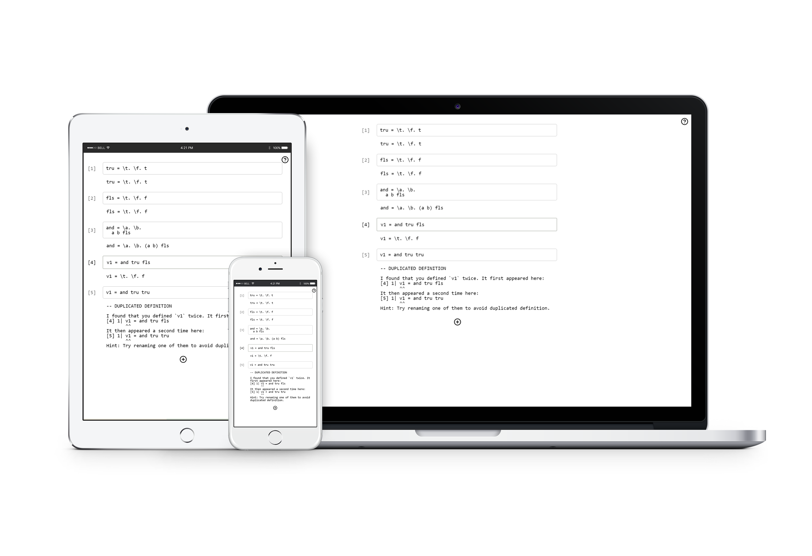

# Lambda Calculus Repl

An intuitive repl for lambda calculus written in Elm.



Try repl [here](https://alienkevin.github.io/lambda-calculus-untyped/)!

# Features

* Cell-based repl with flexible editing
* Instant evaluations and problem feedbacks
* Tailored experiences for all devices

# Development
1. Install [elm-live](https://github.com/wking-io/elm-live).

2. At the project root directory, start elm-live server
```
./start.sh
```
> Note: You may need to run `chmod +x ./start.sh` to enable execution permission.

# Deployment
At the project root directory, run `build.sh` to create an optimized and minimized build:
```
./build.sh
```
> Note: You may need to run `chmod +x ./build.sh` to enable execution permission.

# License
MIT

# Change Log

## Release v0.3.0

* Save model automatically to LocalStorage
* Add settings popup for evaluation strategy
* Add tooltips for buttons

## Release v0.2.0

* Evaluate all cells when editing one cell
* Track cell index in checker for problems like duplicated definition
* Enforce end of def and expr when parseDef and parseExpr
* Replace line prompt with cell index
* Place add cell button at the active cell

# Release v0.1.0

* Basic repl support